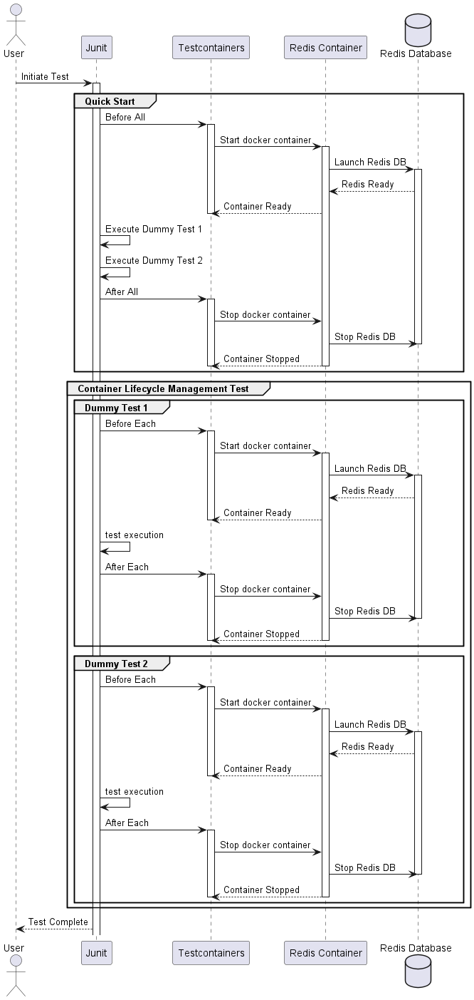

# Testcontainers Quick Start Guide

Welcome to this simple proof of concept for Testcontainers. Dive in to understand how to effectively use Testcontainers with JUnit tests.

## 📑 Table of Contents

- [Overview](#overview)
- [How to Run](#how-to-run)
- [Examples Breakdown](#examples-breakdown)
    - [Container Lifecycle Management](#1-container-lifecycle-management)
    - [Quick Start](#2-quick-start)
- [Key Takeaway](#key-takeaway)

## Overview

We present two core examples in this repository:

1. **Container Lifecycle Management**: Manually managing the lifecycle of a Redis container.
2. **Quick Start**: Utilizing Testcontainers' built-in JUnit integration for automatic container lifecycle management.

## How to Run

1. 🐳 Ensure Docker is up and running.
2. 📦 Clone this repository.
3. 🚀 Navigate to the project directory and execute tests using your IDE or through Maven/Gradle.

## Examples Breakdown

### 1. Container Lifecycle Management
This showcases a Redis container with a manual lifecycle:

- The container gets fired up in the `@BeforeEach` setup.
- Post each test, the `@AfterEach` stops the container if it's still running.
- Test scenarios:
    - `test_dummyTest1`: A basic placeholder test.
    - `test_stoppingContainer`: Stops the container within the test.
    - `test_stopAndStartContainer`: Stops and restarts the container during a test run.

### 2. Quick Start
This example harnesses the power of Testcontainers' JUnit support:

- The `@Container` annotation lets Testcontainers control the container's lifecycle.
- The container is activated before tests and terminated post-completion.
- For demonstration, two dummy tests are present.

## Key Takeaway

🔑 Testcontainers integrates Docker containers smoothly into JUnit testing environments. Whether it's manual control or automatic handling through Testcontainers, the process is streamlined and effective.

**Happy Testing with Containers!** 🐳
