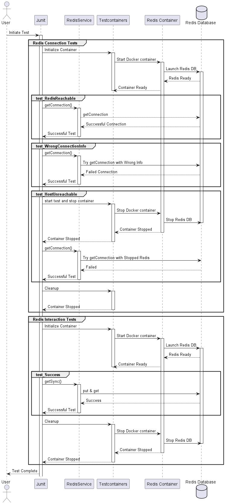

# Testing Redis with Testcontainers

Learn how to effectively test Redis interactions using Testcontainers in JUnit.

## 📑 Table of Contents

- [Introduction](#introduction)
- [How to Use](#how-to-use)
- [Test Breakdown](#test-breakdown)
- [Final Thoughts](#final-thoughts)

## Introduction

This repository provides examples of how to test interactions with a Redis database using Testcontainers. We set up a Redis container and run different test scenarios against it to understand various Redis behaviors and edge cases.

## How to Use

1. 🐳 Make sure Docker is installed and running.
2. 📦 Clone this repository.
3. 🚀 Run the tests via your preferred IDE or through Maven/Gradle.

## Test Breakdown

### Abstract Base for Redis Tests

All our Redis-related tests inherit from `AbstractBaseRedisServiceTest`, which:

- Sets up a Redis container.
- Exposes utility methods to fetch the Redis container host and port.

### Redis Connection Tests

`RedisServiceGetConnectionTest` provides tests to:

- **Check Redis Reachability**: Tests the creation of a successful connection to Redis.
- **Handle Incorrect Connection Info**: Ensures our application can handle wrong Redis connection details gracefully.
- **Test Unreachable Host**: Validates the behavior when the Redis host is not available.

### Redis Interaction Tests

`RedisServiceInteractionTest` offers tests to:

- **Basic Interaction**: Test the success scenario of putting and getting a value.
- **Host Unreachability during Interaction**: Check how our application behaves if Redis becomes unreachable during an operation.

## Final Thoughts

Testing Redis (or any database) interactions is crucial to ensure data consistency and application stability. Testcontainers provides a handy way to run these tests against real instances without much setup, making the testing process more authentic and reliable.

Happy containerized testing! 🐳🔧
